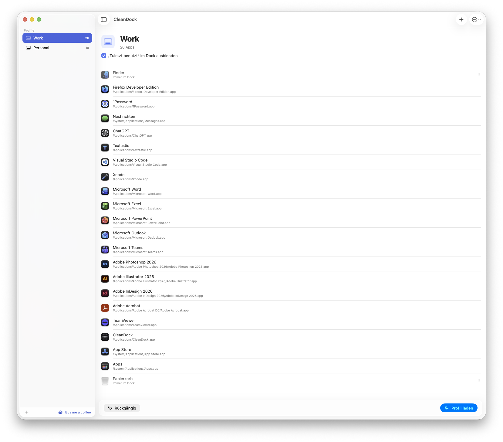
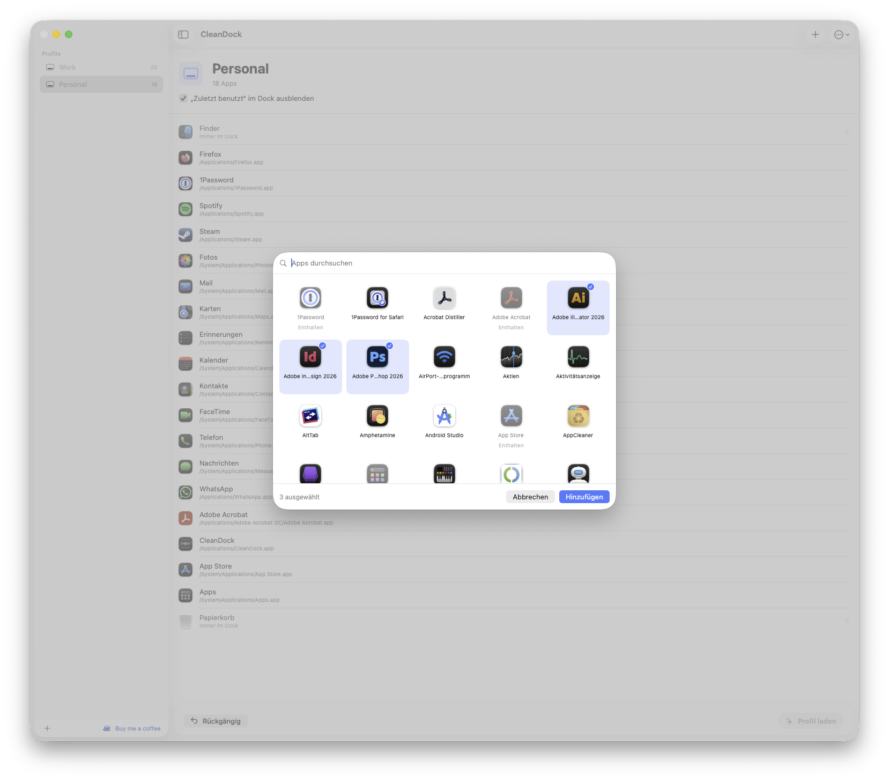
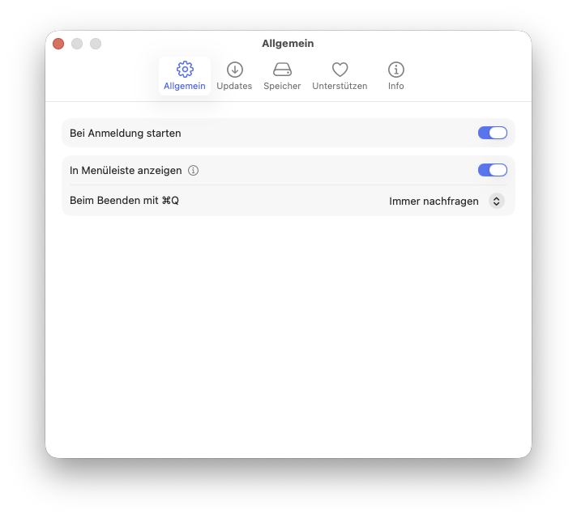

# CleanDock

[](https://github.com/hypeIT-GmbH/CleanDock/releases)
[](https://github.com/hypeIT-GmbH/CleanDock/actions/workflows/ci.yml)
[](LICENSE)
[](https://buymeacoffee.com/cleandock)

**Profiles for your macOS Dock. Switch it in one click - or roll it out to an
entire fleet.**

CleanDock treats the Dock as something you design once and switch on demand:
a profile is an ordered list of apps, and loading it sets the Dock to exactly
that - same apps, same order, every time. Native SwiftUI, no dependencies,
fully open source.

<picture>
  <source media="(prefers-color-scheme: dark)" srcset=".github/screenshots/hero-dark.png">
  
</picture>

<table>
  <tr>
    <td width="62%">
      <picture>
        <source media="(prefers-color-scheme: dark)" srcset=".github/screenshots/add-apps-dark.png">
        
      </picture>
    </td>
    <td width="38%">
      <picture>
        <source media="(prefers-color-scheme: dark)" srcset=".github/screenshots/settings-dark.png">
        
      </picture>
    </td>
  </tr>
</table>

<sub>Screenshots show the German localization - CleanDock ships fully
localized in English and German.</sub>

## Two ways to use CleanDock

### 🖥 One Mac, many Docks

Your Dock should match what you are doing. Build a profile per context and
switch from the menu bar in one click - no windows, no dragging icons around:

- **Dev Dock** - editor, terminal, simulator, Git client
- **Design Dock** - Figma, photo and video tools
- **Work Dock** - mail, calendar, Slack, browser
- **Gaming Dock** - just the fun stuff

Start by adopting your current Dock as the first profile, duplicate and trim
it per context, done. Every load backs up the previous Dock, so undo is always
one click away.

### 🏢 One Dock, many Macs

For Mac admins, CleanDock turns "please clean up the Docks on 500 machines"
into a deployment artifact:

1. Design the Dock profile in CleanDock on your admin Mac.
2. Export it as a **postinstall script** - CleanDock asks whether the Dock
   should be set right after enrollment or only provisioned for later.
3. Deploy the CleanDock **PKG** plus that script with Jamf, Mosyle, Kandji or
   any other MDM.

Managed profiles apply **exactly once per user** (content-hash based), apply
again automatically whenever you ship an updated profile, and stay visible in
the app as read-only entries users can re-apply - or duplicate into their own
editable profile. Between rollouts, users keep full freedom over their Dock.

## Features

**Profiles**

- Create, rename, duplicate, delete - reorder apps via drag & drop
  (profile order = Dock order)
- Three ways to add apps: a searchable picker of the apps in the standard
  application folders, drag & drop from the Finder straight into position,
  or a file dialog
- Adopt the current Dock as a new profile; per-profile SF Symbol and a
  "hide recent apps" switch; import/export as JSON
- Finder and Trash are shown as fixed rows, so a profile reads as the
  complete Dock - CleanDock never touches them, nor the folders and files
  on the Dock's right side (`persistent-others`)

**Loading**

- Load Profile (⌘⏎) sets the Dock to exactly the profile after a short
  confirmation showing the app count - with an automatic backup first and
  one-click undo; from the menu bar, profiles apply instantly
- Apps that are not installed on the target Mac are skipped silently:
  never an error, just a subtle note plus a cleanup log that explains
  per app why it could not be resolved
- Resolution is robust: bundle identifier first, then the last known
  path, then a name search across the standard application folders

**Menu bar**

- Every profile one click away, without opening the main window
- The menu bar icon is optional; with it enabled, CleanDock politely
  leaves the Dock while no window is open
- ⌘Q asks whether to quit or keep running in the menu bar - rememberable,
  changeable in Settings

**For admins**

- MDM postinstall export with an auto-apply choice per script
- Read-only "Managed" section in the sidebar; a LaunchAgent applies
  pending managed profiles at login
- Embedded CLI for scripting:

```text
cleandock list [--json]           list user + managed profiles
cleandock apply --profile "Name"  apply a named profile
cleandock apply --file p.json     apply the profiles in a JSON file
cleandock apply --managed         apply pending managed profiles
cleandock capture --name "Name"   save the current Dock as a profile
```

The CLI lives at `/Applications/CleanDock.app/Contents/Helpers/cleandock`,
must run in a user context (the Dock is per-user) and exits with `0` even
when apps were skipped - non-zero is reserved for real errors.

**And throughout**

- Native Swift 6 / SwiftUI app for macOS 15+, built against the macOS 26
  SDK with Liquid Glass details
- English and German, fully localized
- Opt-in update check (off by default) - see Privacy below
- Zero third-party dependencies: Apple frameworks only

## Installation

1. Download the PKG from the
   [latest release](https://github.com/hypeIT-GmbH/CleanDock/releases/latest)
   (under "Assets").
2. Install it - the app lands in `/Applications`, the LaunchAgent for managed
   profiles in `/Library/LaunchAgents`.

Homebrew Cask (`brew install --cask clean-dock`) is planned once notarized
releases with stable URLs exist.

### Uninstall

CleanDock installs exactly one background piece - the LaunchAgent for
managed profiles. Removing everything:

```bash
launchctl bootout gui/$(id -u)/de.hypeit.cleandock.apply 2>/dev/null || true
sudo rm -f /Library/LaunchAgents/de.hypeit.cleandock.apply.plist
sudo rm -rf /Applications/CleanDock.app
sudo rm -rf "/Library/Application Support/CleanDock"    # managed profiles
rm -rf ~/Library/Application\ Support/CleanDock         # profiles + backups
defaults delete de.hypeit.cleandock 2>/dev/null || true
sudo pkgutil --forget de.hypeit.cleandock 2>/dev/null || true
```

Your Dock stays exactly as it is - CleanDock never changes it on removal.

## MDM Deployment Guide

1. **Create the profile** in CleanDock on your admin Mac. Order the apps the
   way the Dock should look.
2. **Export the script**: right-click the profile in the sidebar →
   *Export* → *MDM Script (postinstall)*. CleanDock asks whether the script
   should set the Dock right after installation (`autoApply: true`) or only
   deploy the profile for applying it manually later (`autoApply: false`).
   Either way the script embeds the profile JSON and writes it to
   `/Library/Application Support/CleanDock/managed/<slug>-<hash>.json`
   (a short hash of the profile name keeps filenames collision-free).
3. **In your MDM** (Jamf, Mosyle, Kandji, …):
   - deploy the CleanDock **PKG**,
   - attach the exported script as a **postinstall/post script** (runs as root).
4. **Result**: with auto-apply, a logged-in user's Dock is set immediately and
   the LaunchAgent covers the next login otherwise. Deploy-only profiles show
   up in CleanDock's "Managed" section and wait to be applied manually. Apps
   that are not installed yet are skipped and picked up automatically with the
   next profile update (new content = new hash = applied again).

Worth knowing:

- Idempotency is per user and per content hash (marker files in
  `~/Library/Application Support/CleanDock/managed-applied/`): each managed
  profile applies exactly once - and again whenever its content changes.
- The login-time apply is diagnosable via the unified log:
  `log show --last 1h --predicate 'subsystem == "de.hypeit.cleandock"'`.
- Users may customize their Dock afterwards; re-enforcing is one click in the
  app or `cleandock apply --managed` after removing the marker - or simply
  ship a new profile version.

## Build from Source

Requirements: Xcode 26, [XcodeGen](https://github.com/yonaskolb/XcodeGen)
(`brew install xcodegen`).

```bash
cd macos
xcodegen                     # generates "CleanDock.xcodeproj"
open "CleanDock.xcodeproj"

# or from the command line:
Scripts/build.sh             # Release build
Scripts/make-pkg.sh          # build + PKG
(cd Core && swift test)      # unit tests
```

Signing is optional - unsigned local builds always work. Official, notarized
PKGs come exclusively from the maintainer (`Scripts/notarize.sh`).

The app icon is fully code-generated: `macos/Scripts/make-icon.sh` renders
the glyph layers of the Icon Composer document at
`macos/App/Resources/AppIcon.icon`, which Xcode compiles into all macOS 26
appearance variants (default/dark/clear/tinted) plus the classic fallback
icon for older systems. (actool caps that fallback `.icns` at 256 px; on
macOS 15+ every consumer uses the full-resolution asset catalog, so this
only affects third-party tools reading the `.icns` directly.)

## Privacy

CleanDock is built for machines where trust matters:

- **No data collection whatsoever** - no telemetry, no analytics, no crash
  reporters.
- **No network connections at runtime**, with one transparent exception: the
  **update check**. It is off by default, can be enabled in Settings (or run
  manually via *Check for Updates…*), and only asks the GitHub API for the
  latest release - nothing about you or your Mac is sent beyond that request.
- **Everything stays local**: profiles in
  `~/Library/Application Support/CleanDock/`, managed profiles in
  `/Library/Application Support/CleanDock/managed/`.
- All other online actions are **user-initiated** browser links
  (GitHub, Releases, Buy me a coffee).

The codebase is small, dependency-free and auditable - `URLSession` appears in
exactly one file (the update check).

## Support the Project

CleanDock is completely free and fully functional - support is voluntary and
never gates features. If it saves you time:

**[☕ Buy me a coffee](https://buymeacoffee.com/cleandock)** ·
**[⭐ Star the repo](https://github.com/hypeIT-GmbH/CleanDock)**

Support is best effort - this project is maintained in spare time. Use
[Issues](https://github.com/hypeIT-GmbH/CleanDock/issues) for bugs and feature
requests, [Discussions](https://github.com/hypeIT-GmbH/CleanDock/discussions)
for questions and ideas.

## Forks

"CleanDock" (name and icon) stays with the maintainer. Forks are expressly
welcome under the MIT license but must use their own name and bundle
identifier.

## License

[MIT](LICENSE) - Copyright (c) 2026 hypeit GmbH
